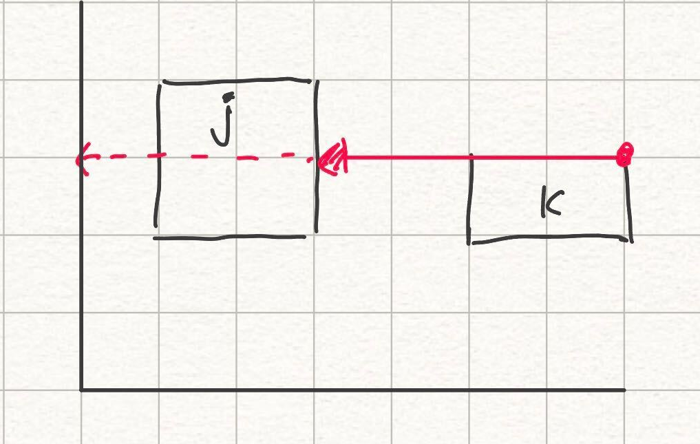

## 実装のメモ

### BL 安定点を探す範囲の工夫
j, k をそれぞれ新しく配置する長方形、すでに配置している長方形とする。

図のように j が配置された後、次に長方形を配置するときに発生する j と k の BL 安定点の候補は、 j の右端から k の右端までとなる。
よって、この区間を長方形を置くたびに更新し、不要な BL 安定点候補を生成しないようにした。

### 不要な BL 安定点候補の削除

長方形を配置したあと、その長方形と重なる BL 安定点候補を削除した。
